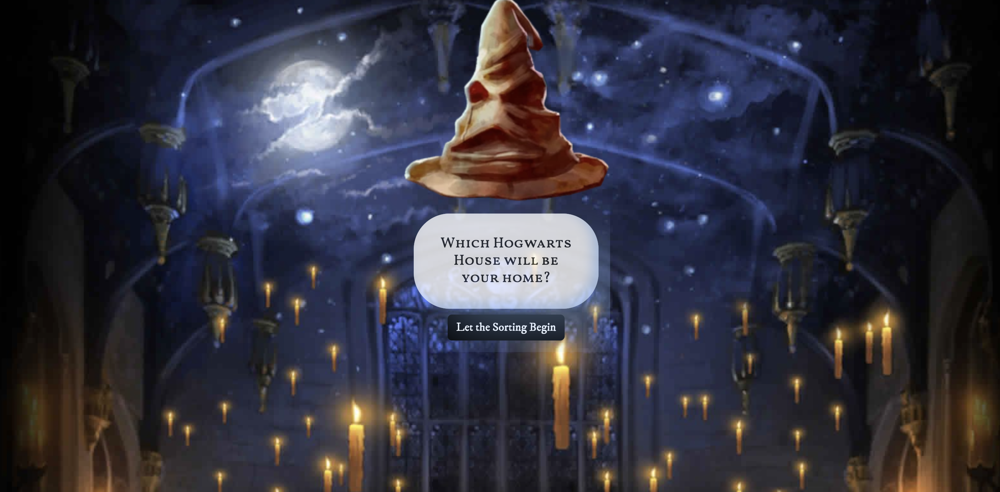
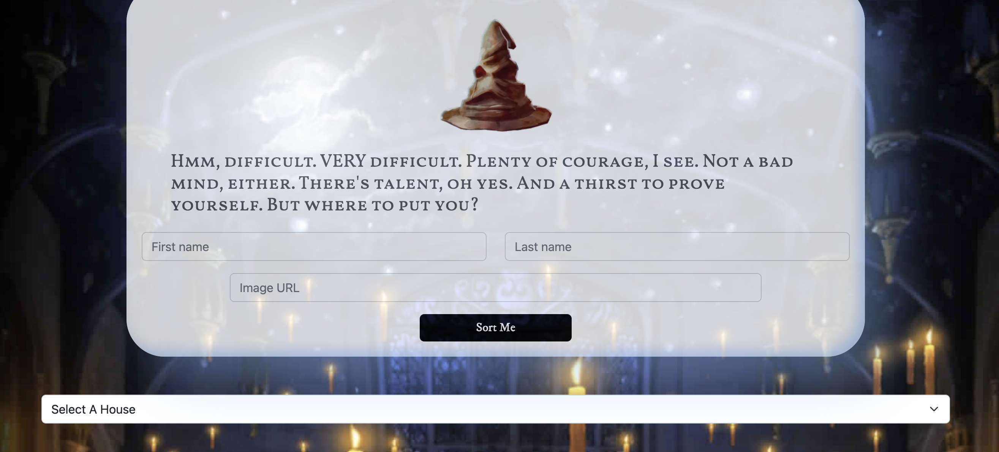

# Sorting Hat Website  [](https://wvance-sorting-hat.netlify.app/#)

(https://wvance-sorting-hat.netlify.app/#)
<!-- update the netlify badge above with your own badge that you can find at netlify under settings/general#status-badges -->

This website features a digital Harry-Potter style "Sorting Hat" with functionality to "sort" unlimited users/person of choice into one of the four Hogwarts houses at random.

[View App](https://wvance-sorting-hat.netlify.app/#)

## Get Started <!-- OPTIONAL, but doesn't hurt -->

```
const startSort = (event) => {
  if (event.target.id.includes("startSort")) {
    renderToDom("#app", mainPage)
    renderToDom("#formBanner", formName);
    // renderToDom("#introCard", clearDiv);
    renderToDom("#enrolled", houseSelect);
    renderAll();
    const houseMenu = document.querySelector("#houseMenu");
    const houseDiv = document.querySelector("#enrolled");
    houseMenu.addEventListener('change', filterHouse);
  }

  const form = document.querySelector("#studentForm")
  form.addEventListener('submit', createStudent);
}
```

## About the User <!-- This is a scaled down user persona -->
- The ideal user for this application is Harry Potter fan who does not have time to fill out a sorting quiz, or does not trust the potential inherent bias in answering questions about oneself in personality quizzes
- For example, a user who knows her sister would be a Slytherin, but that sister claims she always is sorted to Ravenclaw based on easy-to-manipulate online sorting hat-style quizzes
- The problem this app solves for them is it allows them to compromise via a quick, completely random sorting style that is sure to prevent numerous arguments at Thanksgiving

## Features <!-- List your app features using bullets! Do NOT use a paragraph. No one will read that! -->
- When a user submits information via form, a "student" object is created in an existing array which is rendered to the DOM by house value
- A student object can be "expelled" via a button on the student card and removed from the student array, and pushed into a "Voldemort's Army" array that is rendered below the student houses
- Students can be filtered by house on the display screen via a drop-down form field
- If no image link is provided when a user submits a student, a generic Hogwarts logo will be used for their card

## Video Walkthrough of Sorting Hat <!-- A loom link is sufficient -->
https://www.loom.com/share/af9a9e91192a40cead9efbde76cf3b7e

## Relevant Links <!-- Link to all the things that are required outside of the ones that have their own section -->
- [Check out the deployed site](https://wvance-sorting-hat.netlify.app/#)
- [Wireframes](#your-link)
- [Project Board](#your-link)

## Code Snippet <!-- OPTIONAL, but doesn't hurt -->

```
const filterHouse = (e) => {
  const griffId = `<div id="gryffindor" class="house"></div>`;
  const slythId = `<div id="slytherin" class="house"></div>`;
  const ravenId = `<div id="ravenclaw" class="house"></div>`;
  const huffId = `<div id="hufflepuff" class="house"></div>`;
  const allId = `<div id="gryffindor" class="house"></div>
                <div id="slytherin" class="house"></div>
                <div id="ravenclaw" class="house"></div>
                <div id="hufflepuff" class="house"></div>`
  if (houseMenu.value==="1") {
    renderToDom("#allHouses", clearDiv);
    renderToDom("#allHouses", griffId);
    renderGryffindor(students);
  } else if (houseMenu.value==="2") {
    renderToDom("#allHouses", clearDiv);
    renderToDom("#allHouses", slythId);
    renderSlytherin(students);
  } else if (houseMenu.value==="3") {
    renderToDom("#allHouses", clearDiv);
    renderToDom("#allHouses", ravenId);
    renderRavenclaw(students);
  } else if (houseMenu.value==="4") {
    renderToDom("#allHouses", clearDiv);
    renderToDom("#allHouses", huffId);
    renderHufflepuff(students);
  } else if (houseMenu.value==="5") {
    renderToDom("#allHouses", clearDiv);
    renderToDom("#allHouses", allId);
    renderAll(students);
  }
};
```

## Project Screenshots <!-- These can be inside of your project. Look at the repos from class and see how the images are included in the readme -->




## Contributors
- [Wesley Vance](https://github.com/wesleybvance)
